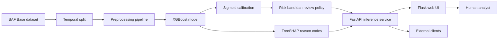

# FraudShield

**AI-assisted fraud risk scoring for bank account opening applications.**

FraudShield adalah proyek portofolio end-to-end machine learning yang memperkirakan risiko fraud pada **pengajuan pembukaan rekening bank**. Sistem menghasilkan probabilitas terkalibrasi, menjelaskan faktor lokal yang memengaruhi skor, dan menyusun antrean pemeriksaan berdasarkan kapasitas tim fraud operations.

> [!IMPORTANT]
> FraudShield merupakan sistem pendukung keputusan. Skor model adalah indikasi risiko, bukan bukti fraud, keputusan kelayakan kredit, atau dasar untuk menerima maupun menolak pengajuan secara otomatis.

## Daftar isi

- [Gambaran umum](#gambaran-umum)
- [Fitur utama](#fitur-utama)
- [Hasil model](#hasil-model)
- [Arsitektur](#arsitektur)
- [Dataset dan pembagian waktu](#dataset-dan-pembagian-waktu)
- [Quick start](#quick-start)
- [Menjalankan workflow ML](#menjalankan-workflow-ml)
- [Inference API](#inference-api)
- [Web UI](#web-ui)
- [Pengujian](#pengujian)
- [Struktur proyek](#struktur-proyek)
- [Batas penggunaan](#batas-penggunaan)
- [Dokumentasi](#dokumentasi)
- [Lisensi](#lisensi)

## Gambaran umum

FraudShield dibangun untuk mendemonstrasikan lifecycle sistem machine learning yang dapat diaudit, mulai dari validasi data hingga penyajian prediksi melalui API dan web UI.

Proyek ini secara khusus menangani **application fraud pada proses onboarding rekening**, bukan fraud pada transaksi yang sudah terjadi. Data yang digunakan bersifat sintetis sehingga tidak memuat data pribadi nasabah sebenarnya.

Prinsip utama proyek:

- Pembagian data secara temporal untuk mendekati kondisi deployment.
- Preprocessing, training, calibration, dan evaluasi yang leakage-safe.
- Probabilitas terkalibrasi, bukan hanya label biner.
- Pemilihan review berdasarkan kapasitas operasional 5%.
- Penjelasan lokal menggunakan TreeSHAP.
- Keputusan akhir tetap berada pada analyst manusia.
- Evaluasi test hanya dilakukan sekali setelah model dan kebijakan dikunci.

## Fitur utama

### Machine learning

- Baseline dummy classifier dan logistic regression berbobot kelas.
- Perbandingan kandidat XGBoost dengan konfigurasi yang telah ditentukan.
- Temporal validation dan deterministic model selection.
- Probability calibration menggunakan sigmoid dan isotonic regression.
- Risk band dan exact-capacity review policy.
- Final evaluation pada untouched test period.
- Bootstrap confidence interval, slice metrics, dan error analysis.

### Explainability dan decision support

- TreeSHAP reason codes untuk setiap prediksi.
- Kontribusi one-hot dan missing indicator digabungkan kembali ke 27 field kontrak.
- Tindakan lanjutan yang membantu analyst melakukan pemeriksaan.
- Penjelasan bersifat lokal dan nonkausal serta tidak menampilkan nilai input sensitif.

### Serving dan antarmuka

- FastAPI inference service dengan startup validation yang fail-closed.
- Versioned production prediction contract.
- Flask web UI sebagai antarmuka utama.
- Single application simulation dan batch review queue.
- Drag-and-drop JSON, validasi client-side, filter, serta ekspor CSV.
- Telemetri agregat tanpa mencatat payload input.

## Hasil model

Model final menggunakan `xgboost_strong_regularization` dengan kalibrasi sigmoid. Evaluasi final dilakukan satu kali pada test month 7 setelah model, calibrator, dan review policy dikunci.

| Metrik | Validation month 6 | Test month 7 |
|---|---:|---:|
| Average precision | 0.176706 | 0.213467 |
| ROC-AUC | 0.891986 | 0.895401 |
| Brier score | 0.012023* | 0.012859 |
| Expected calibration error | 0.000955* | 0.002036 |

\*Nilai validation setelah sigmoid calibration.

Kinerja exact-capacity pada test month 7:

| Metrik operasional | Nilai |
|---|---:|
| Jumlah pengajuan | 96.843 |
| Fraud prevalence | 1,4746% |
| Kapasitas review | 5% |
| Pengajuan yang direview | 4.843 |
| Fraud yang tertangkap | 747 |
| Precision at capacity | 15,4243% |
| Recall at capacity | 52,3109% |

Hasil tersebut menggambarkan performa pada dataset sintetis dan tidak otomatis mewakili performa pada sistem bank nyata.

## Arsitektur



Saat serving, sistem hanya memuat artifact yang telah dikunci. API tidak melakukan fitting, recalibration, threshold reselection, atau evaluasi ulang.

## Dataset dan pembagian waktu

Proyek menggunakan **Base dataset** dari [Bank Account Fraud Dataset Suite](https://github.com/feedzai/bank-account-fraud).

Dataset berisi 1.000.000 baris, 32 kolom, dan periode `month` 0–7. Data mentah tidak disimpan dalam repository. Letakkan file pada:

```text
data/raw/Base.csv
```

Identitas file, checksum, distribusi target, dan aturan semantic missing tersedia di `data/manifest.json`.

### Temporal split

| Tujuan | Periode |
|---|---|
| Training | Month 0–4 |
| Calibration | Month 5 |
| Validation dan model selection | Month 6 |
| Final untouched test | Month 7 |

Field yang dikecualikan dari model:

- `fraud_bool`
- `month`
- `device_fraud_count`
- `days_since_request`
- `credit_risk_score`

Pengecualian dilakukan untuk mencegah target leakage dan menjaga prediction-time contract.

## Quick start

### Persyaratan

- Python 3.12
- Git
- Dataset `Base.csv` untuk menjalankan workflow training
- Artifact Fase 5 dan 6 untuk menjalankan inference service

### Instalasi

```powershell
git clone https://github.com/SYFDNNN/fraudshield.git
cd fraudshield

py -3.12 -m venv .venv
.\.venv\Scripts\Activate.ps1

python -m pip install --upgrade pip
python -m pip install -e ".[dev,serve,flask]"
```

Jika PowerShell memblokir aktivasi virtual environment, jalankan proses menggunakan interpreter secara langsung:

```powershell
.\.venv\Scripts\python.exe -m pip install -e ".[dev,serve,flask]"
```

## Menjalankan workflow ML

Jalankan setiap fase secara berurutan dari root repository.

### Fase 3 — Baseline experiments

```powershell
python -m fraudshield.train --config configs/base.yaml
```

Notebook alternatif: `notebooks/03_model_experiments.ipynb`.

Fase ini membandingkan dummy classifier, class-weighted logistic regression, dan logistic-regression ablation. Seluruh transformer berada di dalam pipeline dan hanya di-fit pada train month 0–4.

### Fase 4 — XGBoost model selection

```powershell
python -m fraudshield.model_selection --config configs/base.yaml
```

Notebook alternatif: `notebooks/04_xgboost_model_selection.ipynb`.

Kandidat dipilih pada validation month 6 menggunakan average precision, recall at 5% capacity, Brier score, waktu training, dan deterministic tie-breaker. `scale_pos_weight` dihitung hanya dari label training.

### Fase 5 — Calibration dan threshold policy

```powershell
python -m fraudshield.calibrate --config configs/base.yaml
```

Notebook alternatif: `notebooks/05_calibration_threshold.ipynb`.

Sigmoid dan isotonic di-fit pada month 5, kemudian dipilih pada month 6 berdasarkan Brier score dengan average-precision guardrail. Fase ini juga membentuk:

- Exact-capacity review policy 5%.
- Risk band `sangat_tinggi`, `tinggi`, `menengah`, dan `rendah`.
- Deterministic tie-breaking pada batas kapasitas.

### Fase 6 — Final evaluation

```powershell
python -m fraudshield.final_evaluate --config configs/base.yaml
```

Notebook alternatif: `notebooks/06_final_evaluation.ipynb`.

Workflow memverifikasi hash seluruh artifact sebelum membuka month 7. Setelah evaluasi selesai, completion artifact mencegah test evaluation kedua. Tidak tersedia opsi `force` untuk menimpa hasil final.

Artifact workflow ML disimpan di `artifacts/` dan tidak dilacak oleh Git.

## Inference API

Inference membutuhkan artifact berikut:

```text
artifacts/phase5/calibrated_review_model.joblib
artifacts/phase5/phase5_metadata.json
artifacts/phase6/phase6_metadata.json
artifacts/phase6/final_evaluation_completion.json
```

Jalankan API:

```powershell
python -m uvicorn app.api:app --host 127.0.0.1 --port 8000
```

Dokumentasi interaktif tersedia di:

```text
http://127.0.0.1:8000/docs
```

API hanya berstatus ready apabila hash model, calibrator, locked policy, completion evidence, capacity rate, dan fitted feature order cocok.

### Endpoint utama

| Method | Endpoint | Fungsi |
|---|---|---|
| `GET` | `/health/live` | Liveness check |
| `GET` | `/health/ready` | Readiness dan artifact verification |
| `GET` | `/v1/contract` | Kontrak input dan kebijakan aktif |
| `POST` | `/v1/predict` | Prediksi satu pengajuan |
| `POST` | `/v1/predict/batch` | Prediksi dan exact-capacity batch ranking |
| `GET` | `/v1/metrics` | Telemetri agregat proses inference |

Contoh single request dari PowerShell:

```powershell
$body = Get-Content .\examples\single_request.json -Raw

Invoke-RestMethod `
    -Method Post `
    -Uri "http://127.0.0.1:8000/v1/predict" `
    -ContentType "application/json" `
    -Body $body
```

Single endpoint mengembalikan `exact_capacity_review: null` karena kapasitas hanya bermakna apabila seluruh decision window diproses sebagai satu batch.

## Web UI

### Flask UI — direkomendasikan

Biarkan FastAPI berjalan pada terminal pertama. Pada terminal kedua, jalankan:

```powershell
python -m flask --app app.flask_app run --port 5000
```

Buka:

```text
http://127.0.0.1:5000
```

Untuk development dengan auto-reload:

```powershell
$env:FLASK_DEBUG = "true"
python -m flask --app app.flask_app run --port 5000
```

Workspace Flask terdiri dari:

- **Overview** — status sistem, kontrak aktif, guardrail, serta aktivitas sesi terakhir.
- **Simulation Playground** — simulasi satu pengajuan dengan preset risiko rendah, menengah, dan tinggi.
- **Review Queue** — upload complete decision window, validasi, exact-capacity ranking, filter, dan ekspor CSV.
- **Model & System** — identitas model, field wajib dan terlarang, missing semantics, serta contoh API request.

Sembilan belas sinyal yang biasanya berasal dari sistem bank dibuat read-only secara default. Pengubahan hanya tersedia melalui mode eksperimen untuk kebutuhan demo.

### Docker Compose

```powershell
docker compose up --build
```

Konfigurasi container memasang folder `artifacts/` secara read-only pada API. Periksa `docker-compose.yml` untuk service dan port yang aktif pada versi repository Anda.

## Pengujian

```powershell
python -m pytest -q -p no:cacheprovider
python -m ruff check --no-cache src app tests
python -m pip check
```

## Struktur proyek

```text
fraudshield/
├── app/                  # FastAPI, Flask, templates, dan static assets
├── artifacts/            # Model dan evaluation artifacts lokal; diabaikan Git
├── configs/              # Konfigurasi eksperimen dan serving
├── data/                  # Dataset lokal dan manifest
├── docs/                  # Kontrak, arsitektur, dan panduan teknis
├── examples/              # Contoh single dan batch request
├── notebooks/             # Audit, eksperimen, calibration, dan evaluasi
├── reports/               # Data card, model card, serta laporan tiap fase
├── src/fraudshield/       # Package utama machine learning
├── tests/                 # Unit dan integration tests
├── docker-compose.yml
├── Dockerfile
└── pyproject.toml
```

## Batas penggunaan

FraudShield **tidak**:

- Memastikan seseorang melakukan fraud.
- Memverifikasi KTP, wajah, kepemilikan email, atau kepemilikan nomor telepon.
- Menganalisis transaksi rekening setelah onboarding.
- Melakukan credit scoring.
- Menghasilkan penolakan otomatis.
- Menggantikan investigasi dan keputusan analyst manusia.

Nilai finansial menggunakan unit dataset sintetis, bukan IDR atau USD. Kode kategori seperti `AA`, `BA`, dan `CA` dianonimkan oleh dataset, sehingga proyek tidak menebak arti bisnis yang tidak didokumentasikan.

### Responsible use

- Jangan memasukkan NIK, nomor rekening, nama, email, nomor telepon, atau data pribadi nyata ke demo publik.
- Perlakukan probabilitas dan reason codes sebagai sinyal prioritas pemeriksaan.
- Lakukan validasi data, fairness assessment, security review, dan monitoring sebelum mempertimbangkan deployment nyata.
- Pastikan keputusan yang berdampak pada nasabah selalu memiliki human oversight dan jalur banding yang sesuai.

## Dokumentasi

- `docs/project_charter.md`
- `docs/prediction_time_contract.md`
- `docs/production_prediction_contract.md`
- `docs/architecture.md`
- `docs/flask_ui_guide.md`
- `reports/data_card.md`
- `reports/model_card.md`
- `reports/phase4_model_selection.md`
- `reports/phase5_calibration_threshold.md`
- `reports/phase6_final_evaluation.md`
- `reports/phase7_inference_serving.md`
- `reports/phase8_explainability.md`

## Lisensi

Source code FraudShield menggunakan lisensi MIT. Dataset tetap mengikuti ketentuan penyedia dan tidak termasuk dalam lisensi repository ini.

---

Built as an end-to-end machine learning portfolio project for fraud risk decision support.
