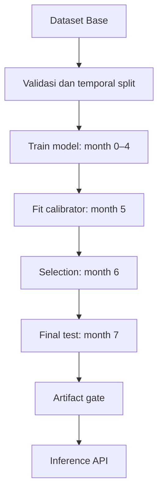
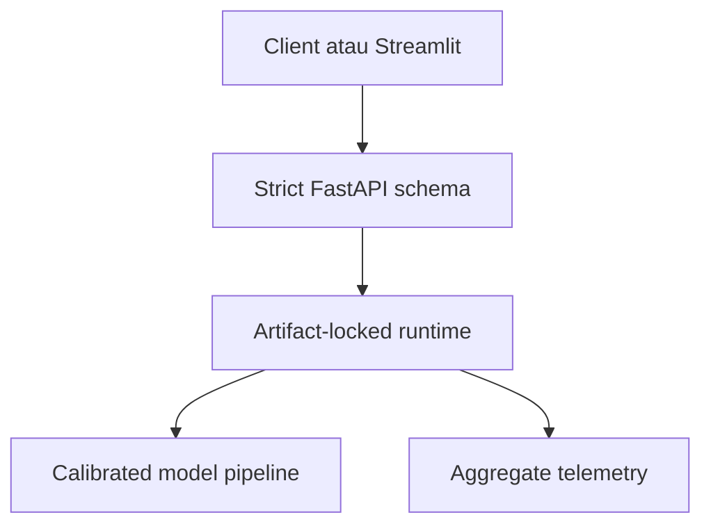

# Arsitektur FraudShield

Arsitektur sampai Fase 7 memisahkan development, calibration, selection, final
evaluation, dan serving berdasarkan waktu serta trust boundary.

Aturan utama arsitektur adalah satu pipeline preprocessing yang sama untuk
training, evaluasi, dan inference. Preprocessing berada di dalam artifact model
dan tidak di-fit ulang setelah model dasar dikunci.

## Batas keputusan temporal

| Komponen | Periode yang boleh digunakan |
| --- | --- |
| Preprocessing dan model dasar | Month 0–4 |
| Fitting calibrator | Month 5 |
| Model, calibrator, threshold, dan risk-band selection | Month 6 |
| Pelaporan final satu kali | Month 7 |

## Freeze dan final evaluation

Sebelum month 7 dibuka, workflow Fase 6 memverifikasi artifact Fase 5 dan
menulis `freeze_manifest.json`. Manifest mencatat hash model serta seluruh
kebijakan evaluasi. Completion artifact ditulis terakhir setelah semua hasil
berhasil disimpan.

Run berikutnya memverifikasi hash hasil dan menggunakan output tersimpan tanpa
membaca test kembali. Perubahan setelah hasil test terlihat harus diperlakukan
sebagai generasi model baru yang memerlukan test periode masa depan, bukan
pengulangan evaluasi month 7.

State yang menunjukkan test pernah dibuka tetapi hasil belum lengkap memblokir
retry otomatis. Satu-satunya recovery otomatis adalah menulis ulang completion
marker dari satu set hasil lengkap yang hash-nya sudah direkam; recovery ini
tidak membaca dataset.

## Batas penggunaan

- Score hanya untuk prioritas review manual.
- Exact-capacity policy mengontrol beban antrean; fixed threshold mengukur
  transfer cutoff validation ke test.
- Risk band bukan bukti fraud.
- Tidak ada automated rejection.
- Reporting alert tidak menjalankan tuning otomatis.

## Serving Fase 7

FastAPI adalah satu-satunya komponen yang memuat artifact model. Streamlit
hanya menjadi HTTP client dan tidak memiliki akses ke raw dataset, label, atau
model. Runtime memverifikasi hash model dan bukti evaluasi final sebelum
readiness berhasil.

Single request menghasilkan probability dan fixed-threshold signal tanpa
exact-capacity claim. Batch request harus merepresentasikan seluruh decision
window; runtime kemudian memberi ranking deterministik dan tepat
`ceil(rows × 5%)` review flags.

Artifact model di-mount read-only pada container. Image berjalan sebagai user
non-root. TLS, authentication, rate limiting, durable audit storage, dan
central monitoring berada pada API gateway/platform boundary dan belum
diimplementasikan oleh demo lokal.
