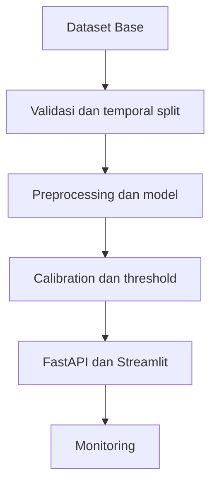

# Arsitektur FraudShield

Dokumen ini masih bersifat awal dan akan diperbarui setelah pipeline produksi
selesai.

Aturan utama arsitektur adalah satu pipeline preprocessing yang sama untuk
training, evaluasi, dan inference.
